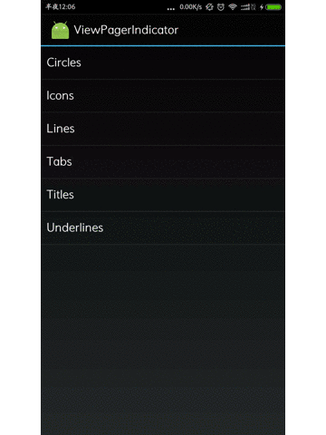

##Android------指示器大全

####来源于Jake Wharton大神的源码

####终于把源码看完了，并重新复写，更改了一些地方，去掉了一些多余的代码，添加中文注释，方便阅读。

####感觉收获很大，获得到了构思和方法设定上的一些启示，后来看到开源工程的文档后，原来有很多人都在学习这个源码，看了别人的分析后更加明白了。就像发起者说的一样，我们不重复造轮子不表示我们不需要知道轮子该怎么造及如何更好的造！

***
####ViewPagerIndicator--- [分析文档](http://a.codekk.com/detail/Android/lightSky/ViewPagerindicator%20%E6%BA%90%E7%A0%81%E8%A7%A3%E6%9E%90)
***

##demo(Android Studio)
#####用法:将viewpager作为一个独立的Module,作为类库引用

####截图

